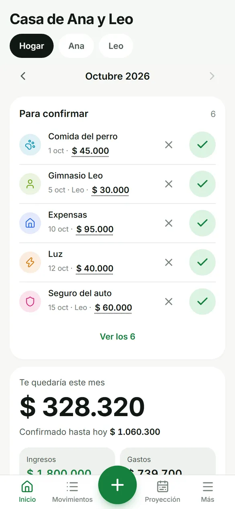
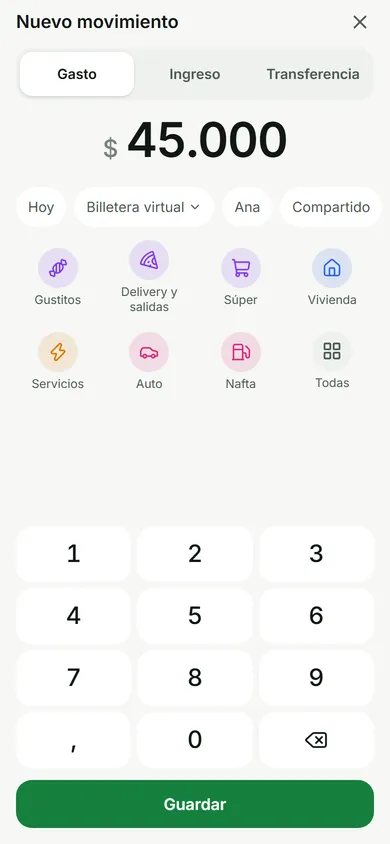
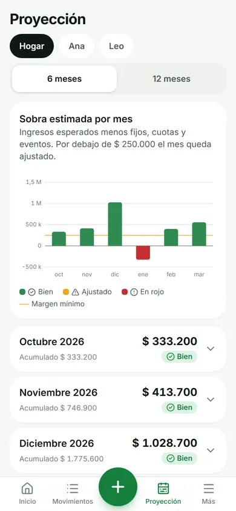
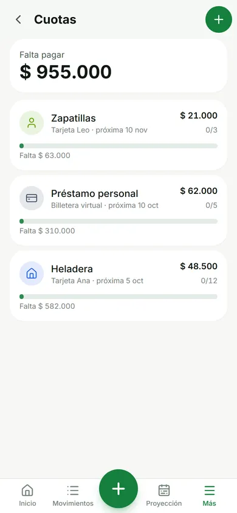

# Ahorria

**Tu plata, ordenada con IA.** Lo que entra, lo que sale y, sobre todo, lo que viene.

Ahorria es una app web para llevar las finanzas de una pareja o familia: se usa desde el celular
(instalable como app), cargás un gasto en tres toques y te muestra cuánto te va a sobrar en los
próximos meses, con las cuotas, los gastos fijos y los cumpleaños ya contemplados.

Es **código abierto y self-hosted**: cada hogar levanta su propia instancia, con su propia base de
datos. Nadie más ve tus números.

<p align="center">
  
  
  
  
</p>

<sub>Capturas con datos de ejemplo.</sub>

## Qué hace

- **Carga rápida**: monto, categoría, guardar. Cuenta, fecha, persona y ámbito se completan solos
  (y se pueden cambiar). Con IA configurada, también podés escribir «super 45 mil con MP».
- **Gastos e ingresos fijos** que cada mes quedan *para confirmar* con un toque (editando el monto
  si cambió). Los variables, como el súper o la nafta, se cargan compra por compra.
- **Cuotas**: una compra en 12 cuotas son 12 gastos futuros; ves cuánto de tus próximos sueldos ya
  está comprometido.
- **Tarjetas a mes vencido**: lo que consumís en octubre impacta en el flujo de noviembre.
- **Vistas por persona y del hogar**: cada uno ve lo suyo y el hogar ve todo. Las transferencias
  entre ustedes no cuentan como gasto (nada se cuenta dos veces).
- **Proyección a 6 o 12 meses**: ingresos esperados, fijos, cuotas y eventos (cumpleaños, fiestas),
  con la sobra de cada mes y aviso cuando un mes viene ajustado o en rojo.
- **Pesos y dólares**: cada gasto en USD guarda su cotización.
- **PWA**: se instala en el celular y se abre como una app.

## Levantarla con Claude Code (recomendado)

1. Cloná el repo y abrilo con [Claude Code](https://claude.com/claude-code).
2. Escribí: **«quiero instalar Ahorria»**.

El skill [`setup`](.claude/skills/setup/SKILL.md) te guía paso a paso: instala, crea la base, te
entrevista para cargar tus cuentas, sueldos, gastos fijos y cuotas, configura el login con Google y
lo deja publicado en Vercel. Tus datos quedan en archivos que nunca se suben al repo.

## Levantarla a mano

Requisitos: Node 22+, y Docker para probar en local (o cualquier Postgres).

```bash
git clone https://github.com/demateopablo/ahorria && cd ahorria
npm install
cp .env.example .env          # completá SESSION_SECRET y poné ALLOW_DEV_LOGIN=true para probar
npm run db:up                 # Postgres local en docker
npx prisma migrate deploy
npm run seed -- --file seed/household.example.json   # datos de ejemplo
npm run dev                   # http://localhost:5173 → «Entrar como Ana»
```

Para tus datos, copiá `seed/household.example.json` a `seed/household.local.json`, editalo (el
formato está documentado en `seed/schema.ts`) y corré `npm run seed -- --reset`.

### Producción

Necesitás tres cuentas gratuitas: [Neon](https://neon.tech) (base de datos),
[Vercel](https://vercel.com) (hosting) y [Google Cloud](https://console.cloud.google.com) (login).
El paso a paso está en el [skill de setup](.claude/skills/setup/SKILL.md) (sección 5).

[](https://vercel.com/new/clone?repository-url=https%3A%2F%2Fgithub.com%2Fdemateopablo%2Fahorria&env=DATABASE_URL,SESSION_SECRET,GOOGLE_CLIENT_ID,VITE_GOOGLE_CLIENT_ID&envDescription=Connection%20string%20pooled%20de%20Neon%2C%20un%20secreto%20aleatorio%20y%20el%20Client%20ID%20de%20Google&envLink=https%3A%2F%2Fgithub.com%2Fdemateopablo%2Fahorria%2Fblob%2Fmain%2F.claude%2Fskills%2Fsetup%2FSKILL.md)

Antes del primer uso hay que migrar y cargar la base de Neon desde tu compu
(`npx prisma migrate deploy` y `npm run seed` con las URLs de Neon).

### Variables de entorno

| Variable | Para qué |
|---|---|
| `DATABASE_URL` | Postgres. En Neon, la connection string *pooled*. |
| `DIRECT_URL` | Opcional: conexión directa para migraciones en Neon. |
| `SESSION_SECRET` | Secreto aleatorio para firmar la sesión. |
| `GOOGLE_CLIENT_ID` / `VITE_GOOGLE_CLIENT_ID` | El mismo Client ID de Google, para el server y el front. |
| `LLM_BASE_URL` / `LLM_API_KEY` / `LLM_MODEL` | Opcional: IA con cualquier proveedor compatible con OpenAI (OpenRouter, OpenAI, Groq, Ollama…). |
| `ALLOW_DEV_LOGIN` | Solo local: entrar sin Google. Nunca funciona en Vercel. |

## Cómo está hecha

React 19 + Vite + Tailwind 4 (PWA) · API con [Hono](https://hono.dev) en una sola Vercel Function ·
Postgres con Prisma 7 · montos en `Decimal`, nunca `float` · tests con Vitest (lógica de dominio y
API contra Postgres real). Detalles y reglas del dominio en [`CLAUDE.md`](CLAUDE.md).

```bash
npm test        # dominio + API (la API necesita TEST_DATABASE_URL; npm run db:up la crea)
npm run lint
npx tsc -b
```

## Privacidad

- Cada instancia es de un hogar: los datos viven en **tu** base, no en un servidor compartido.
- Solo entran las personas cuyo email de Google cargaste en *Más → Personas*.
- La app instalada no guarda tus datos financieros en el celular (el service worker no cachea la API).
- Si configurás IA, el texto que escribís para cargar un gasto se envía al proveedor que elegiste.

## Licencia

[MIT](LICENSE). Fotos de Unsplash y demás créditos en [CREDITS.md](CREDITS.md).
